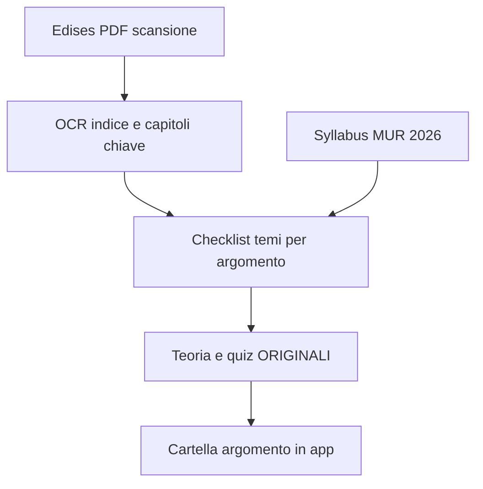

# Cartelle per argomento (tutte le materie)

## Perché
Oggi una cartella = 1 unità MUR con 4 sottotitoli (es. Fisica 2: cinematica + dinamica + lavoro/energia + quantità di moto). Troppo per un solo triage/verifica. Obiettivo: **1 cartella = 1 sottotitolo**, con solo un indizio dell’unità MUR di appartenenza, **teoria più ricca**, **video aula**, e contenuti **allineati a Edises + syllabus** senza copiare i libri.

Default scelto: **~84 cartelle-argomento**; CFU ripartiti in parti uguali; calendario/progresso a livello di argomento.

## Vincolo Edises (non negoziabile)
I file in [`files/`](files/) (`Biologia - Edises.pdf`, `Chimica - Edises.pdf`, `FIsica - Edises.pdf`) sono commerciali e in gran parte **scansioni** (poco testo selezionabile).

**Si può / si farà:**
- OCR mirato (tesseract + render pagine) su **indici, titoli di capitolo/paragrafo** e campioni di pagina per capire cosa tratta ogni blocco.
- Mappare quei temi → id argomento (`fis-2-cinematica`, …).
- Scrivere teoria, esempi, trappole e quiz **originali** che **coprono** gli stessi nodi (e il syllabus MUR).
- Usare anche Simulazione I/II SF già in `files/` come calibrazione di difficoltà (come in passato: solo temi, non stem copiati).

**Non si può:**
- Incollare brani, elenchi, figure o domande Edises/SF nell’app.
- Dump OCR integrale del libro come contenuto UI.

In pratica: sì, **si riempiono tutti gli argomenti** guidati da Edises; il testo in app è **riscritto**.

## Modello dati
In [`src/types.ts`](src/types.ts) / [`src/data/unita.ts`](src/data/unita.ts):

- Entità **Argomento** (id tipo `fis-2-cinematica`): `parentUnitaId`, `titolo`, `materia`, `cfu` ≈ parent/n, `ordine`.
- 21 unità MUR = **gruppi** in home (badge «Unità N»), non cartelle di studio uniche.
- Approfondimenti `extra-*` restano; `collegataA` verso id argomento.

Home: materia → «Unità N · titolo MUR» → card argomenti. Route: `/unita/:id` con nuovi id. Studio = [`UnitaPage`](src/pages/UnitaPage.tsx).

## Contenuti per argomento

### Workflow riempimento (Edises + MUR)
1. Catalogo 84 argomenti dai `sottotitoli`.
2. OCR indici Edises Bio/Chim/Fis → file checklist interno (es. `src/data/content/edisesTopicMap.ts`: argomento → elenco bullet di temi da coprire).
3. Per ogni argomento: teoria 2–4 sezioni + `perCapireMeglio` che **spuntano** la checklist; quiz diagnostico (~5), esercizi (~10–15), verifica (~8–10 pool / 8 in UI).
4. Gap checklist senza copertura → priorità di scrittura.

### Teoria più dettagliata
- Sezioni: concetto → metodo/formule → biomedico / trappola esame.
- Testo originale espanso rispetto alle sezioni attuali (non solo split).
- Figure/sketch da registry dove già esistono.

### Video aula (1+ per argomento)
[`src/data/videos.ts`](src/data/videos.ts) keyed by id argomento; almeno 1 YouTube (preferenza italiano); fallback sul miglior video parent con `perché` esplicito.

### Quiz e simulazioni
Partizione banche attuali + topping da checklist. Simulazioni aggregheranno tutti gli argomenti della materia.

## Progresso e calendario
- Migrazione: copia colore parent → figli; azzera sessioni esercizi.
- Calendario per argomento; ore da CFU frazionato.

## Implementazione (ordine)
1. Catalogo argomenti.
2. OCR Edises → `edisesTopicMap` (checklist, non testo libro).
3. UI home + routing.
4. Teoria dettagliata + quiz per argomento secondo checklist.
5. Video 1+ per argomento.
6. Calendario + migrazione; smoke test.

## Fuori scope
- Copia verbatim Edises/SF.
- OCR dump integrale dei tomi come pagina di studio.
- 40 esercizi × 84 argomenti.
- Cambiare formato simulazione a 3 prove (già implementato altrove).
